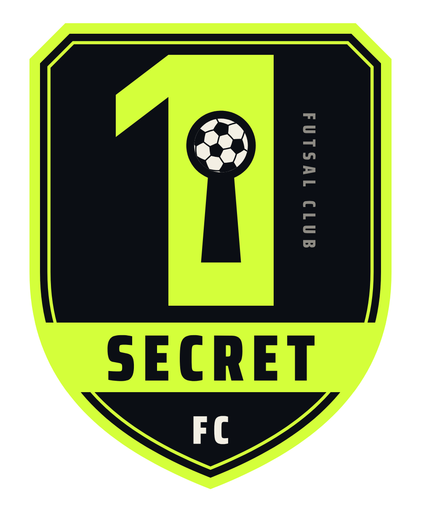

# 1 Secret FC

Logo set for 1 Secret FC, a futsal club.

<p align="center"></p>

## The idea

A big number 1 with a keyhole cut through it, and a futsal ball sitting in the round part of the keyhole. That one mark covers the number, the secret and the sport. The crest reads top to bottom as the name: **1**, **SECRET**, **FC**.

The shield uses the flat top, chamfered corners and heavy condensed type you see on a lot of recent club crests. The roundel takes after the simple ring badges several big clubs have moved to. The small vertical "FUTSAL CLUB" beside the 1 fills the space the numeral leaves on the right.

## Files

| File | Use it for |
| --- | --- |
| `logo/svg/1-secret-fc-crest.svg` | Main logo. Shirts, posters, anything official |
| `logo/svg/1-secret-fc-crest-gold.svg` | Alternate colourway (special kits, awards) |
| `logo/svg/1-secret-fc-crest-mono-white.svg` | One colour on dark photos, embroidery, print |
| `logo/svg/1-secret-fc-crest-mono-black.svg` | One colour on light backgrounds, stamps, fax-quality print |
| `logo/svg/1-secret-fc-roundel.svg` (+ `-gold`, `-mono-white`) | Stickers, patches, round profile crops |
| `logo/svg/1-secret-fc-icon.svg` (+ `-gold`) | Social avatars, app icons, favicons |
| `logo/svg/1-secret-fc-lockup-dark.svg` | Crest with the name beside it, on dark backgrounds |
| `logo/svg/1-secret-fc-lockup-light.svg` | Same, on light backgrounds |
| `logo/mockups/home-kit.svg` | Home shirt, front and back |

Every SVG has a PNG with a transparent background in `logo/png/`. All text is converted to outlines, so the files look the same everywhere and nobody needs the font installed.

## Colours

| Name | Hex | Role |
| --- | --- | --- |
| Midnight | `#0B0E14` | Base |
| Volt | `#D4FF3A` | Accent |
| Bone | `#F3EFE4` | Type and the ball |
| Gold | `#E8B04A` | Alternate accent |

## Type

[Saira Condensed](https://fonts.google.com/specimen/Saira+Condensed) (free, Google Fonts). Black (900) for the name, ExtraBold (800) with wide letter spacing for labels like "FUTSAL CLUB".

## Using it

- Below about 64 px tall, switch from the crest to the icon. The ball and the side text get too small to read.
- Leave space around the logo at least as wide as the stem of the 1.
- Keep the ball Bone and Midnight in every colour version, so it always reads as a ball.
- On busy photos, use the one-colour white version.

## Regenerating

The files are drawn by the scripts in `tools/` (Python, with `fonttools` and `shapely`):

```sh
pip install fonttools shapely
# put SairaCondensed-900.ttf and SairaCondensed-800.ttf from Google Fonts in tools/fonts/
cd tools
python3 build.py ../logo/svg
python3 kit.py ../logo/mockups/home-kit.svg
```

Colours, sizes and the crest layout are set near the top of `tools/build.py`.
